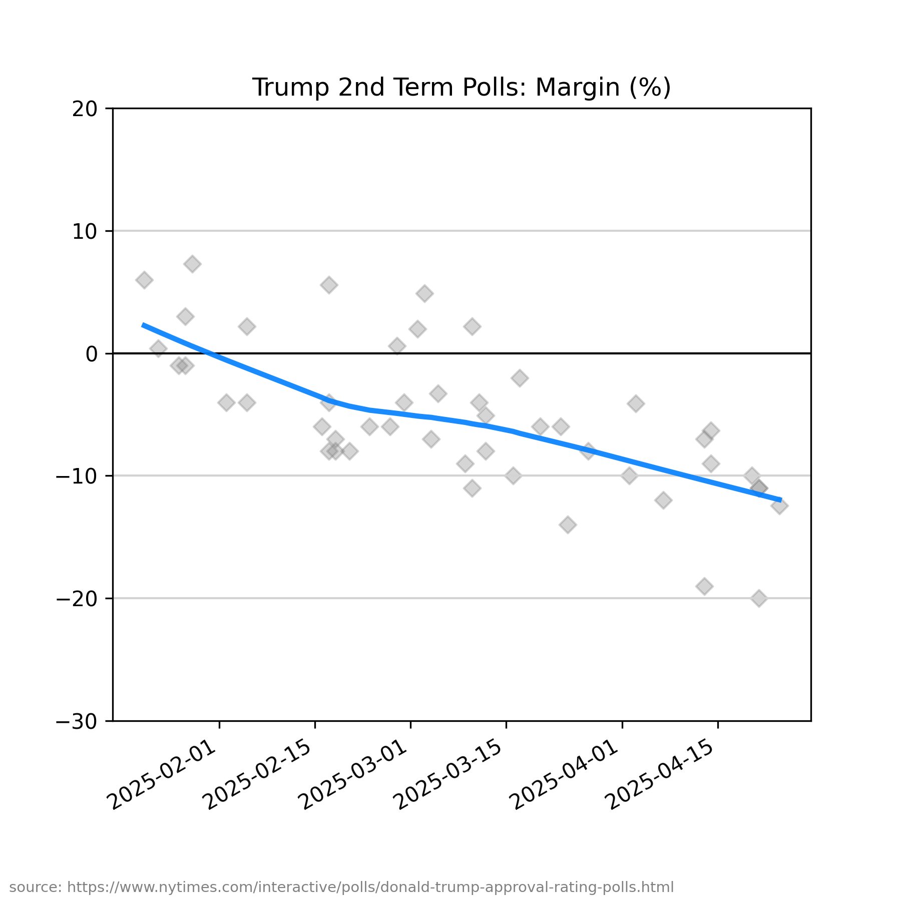

# polls

margin plot (approval minus disapproval) of [the new NY Times presidential polls data](https://www.nytimes.com/interactive/polls/donald-trump-approval-rating-polls.html)

## usage

`polls.py [--help] [--all]`

## configuration

see [polls.toml](https://github.com/haalven/polls/blob/main/polls.toml)

## result (example)

## selected pollsters

* [American Research Group](https://en.wikipedia.org/wiki/American_Research_Group)
* [AP - NORC](https://apnorc.org/)
* [AtlasIntel](https://www.atlasintel.org/)
* [Beacon Research / Shaw & Company Research](https://beaconresearch.com/)
* [CNN / SSRS](https://ssrs.com/)
* [Cygnal Political](https://www.cygn.al/)
* [Emerson College](https://emersoncollegepolling.com/)
* [Gallup](https://www.gallup.com/)
* [Hart Research Associates](https://hartresearch.com/)
* [Ipsos](https://www.ipsos.com/)
* [Marist College](https://maristpoll.marist.edu/)
* [Marquette Law School](https://law.marquette.edu/)
* [Public Opinion Strategies](https://pos.org/)
* [Pew Research Center](https://www.pewresearch.org/)
* [Quinnipiac University](https://poll.qu.edu/)
* [The New York Times / Siena College](https://scri.siena.edu)
* [YouGov](https://yougov.com/)
