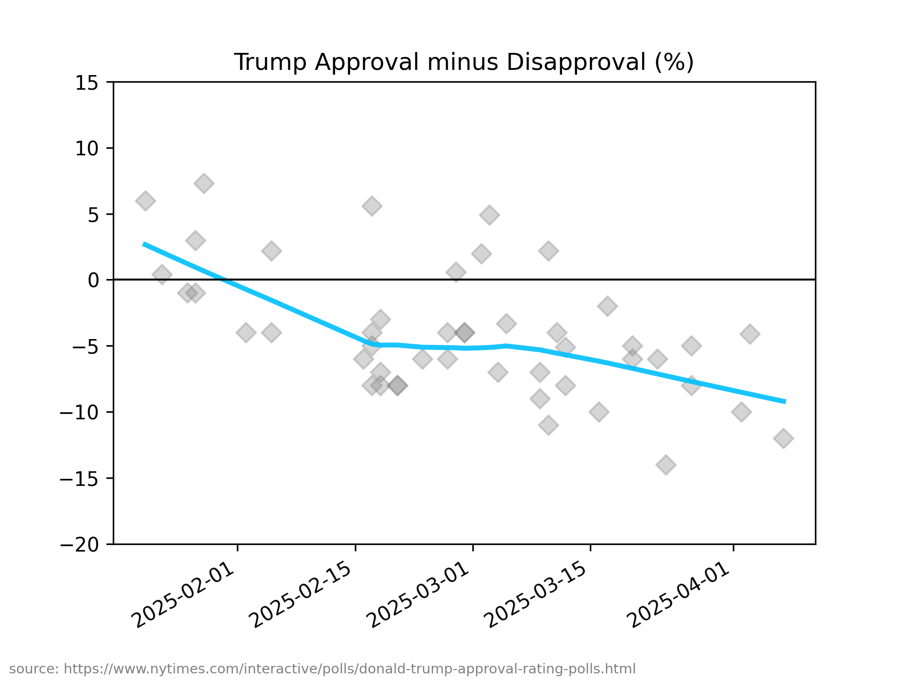

# polls

margin plot (approval minus disapproval) of [the new NY Times presidential polls data](https://www.nytimes.com/interactive/polls/donald-trump-approval-rating-polls.html)

## usage

`polls.py [--help] [--all]`

## configuration

see [polls.toml](https://github.com/haalven/polls/blob/main/polls.toml)

## result (example)

## selected pollsters (A-Z)

* [CNN / SSRS](https://ssrs.com/)
* [Gallup](https://www.gallup.com/)
* [Ipsos](https://www.ipsos.com/)
* [Pew Research Center](https://www.pewresearch.org/)
* [Quinnipiac University](https://poll.qu.edu/)
* [The New York Times / Siena University](https://scri.siena.edu)
