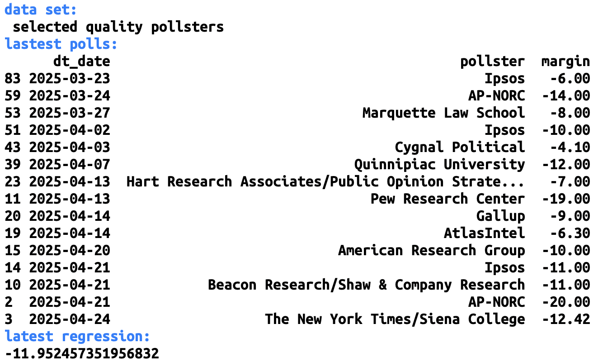

# polls

plot of [the new NY Times presidential polls](https://www.nytimes.com/interactive/polls/donald-trump-approval-rating-polls.html)

## usage

`polls.py [--help] [--all]`

## configuration

see [polls.toml](https://github.com/haalven/polls/blob/main/polls.toml)

## result (example)

